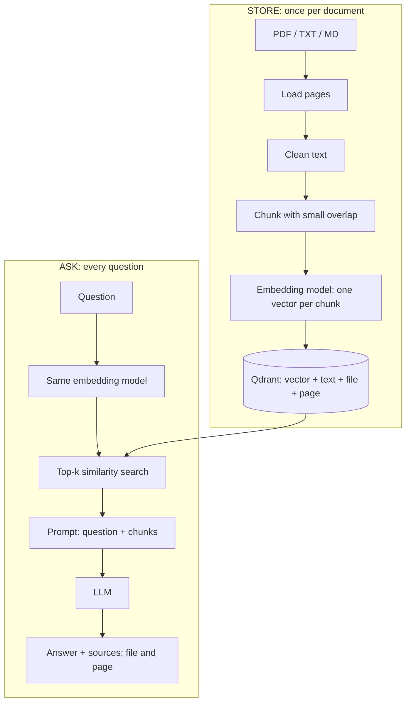

# recallbase-rag

A small RAG (retrieval-augmented generation) knowledge assistant, built **without LangChain**.
Upload documents, ask a question, get an answer with the pages it came from.

Every step is written by hand: loader, cleaner, chunker, embedder, vector store wrapper,
retriever, prompt builder and LLM call. A second repo will build the same app with LangChain
so the two can be compared on the same documents and questions.

> **Status:** working locally. Docker, CI and a deployment are not done yet,
> so this is **not** called production-grade. See the roadmap.

## How it works



## Project layout

| File (`src/recallbase_rag/`) | Job |
|---|---|
| `config.py` | Settings from environment variables and `.env` |
| `logging_setup.py` | One logging setup for the whole app |
| `schemas.py` | `Page`, `Chunk`, `SearchHit`, `Answer` (frozen pydantic models) |
| `errors.py` | One base error and one error per layer |
| `loader.py` | PDF (pypdf), TXT and MD to pages |
| `cleaner.py` | Unicode and PDF text clean-up |
| `chunker.py` | Word-safe character chunks with overlap, kept inside a page |
| `embedder.py` | `Embedder` interface and the sentence-transformers implementation |
| `vector_store.py` | `VectorStore` interface and the Qdrant implementation |
| `retriever.py` | Question to top-k chunks |
| `prompt_builder.py` | Numbered context and system prompt |
| `llm.py` | `LLM` interface and the OpenAI implementation |
| `service.py` | The only file that knows the order of the steps |
| `bootstrap.py` | The only file that builds the real classes |
| `evaluation.py` | Hit@k and MRR on a question file |
| `cli.py` | `ingest`, `ask`, `search`, `eval` |
| `ui.py` | Gradio page: upload, ask, see sources |

Embedder, store and LLM are small interfaces (`typing.Protocol`).
Tests use fakes, so they never download a model, open Qdrant or call an API.

## Setup

Needs Python 3.12 and [uv](https://docs.astral.sh/uv/).

```powershell
uv sync
copy .env.example .env
```

Open `.env` and put your OpenAI key in it. `.env` is ignored by git.

Run the web page:

```powershell
uv run python -m recallbase_rag.ui
```

Then open `http://127.0.0.1:7860`, upload a file, press **Store documents**, and ask a question.

Or use the command line:

```powershell
uv run python -m recallbase_rag.cli ingest samples\your-file.pdf
uv run python -m recallbase_rag.cli ask "Your question here"
uv run python -m recallbase_rag.cli search "Your question here"
uv run python -m recallbase_rag.cli eval
```

`search` shows the retrieved chunks and makes no OpenAI call.

Run the tests:

```powershell
uv run pytest -q
```

## Configuration

Environment variables, all with the prefix `RECALLBASE_` except the key.

| Variable | Default | Meaning |
|---|---|---|
| `OPENAI_API_KEY` | none | OpenAI key (no prefix) |
| `RECALLBASE_OPENAI_MODEL` | `gpt-6-luna` | Model used for the answer |
| `RECALLBASE_LOG_LEVEL` | `INFO` | `DEBUG`, `INFO`, `WARNING` or `ERROR` |
| `RECALLBASE_QDRANT_URL` | none | Qdrant server URL. If empty, local storage is used |
| `RECALLBASE_QDRANT_PATH` | `qdrant_data` | Folder for local Qdrant storage |
| `RECALLBASE_QDRANT_COLLECTION` | `recallbase_chunks` | Collection name |
| `RECALLBASE_EMBEDDING_MODEL_NAME` | `BAAI/bge-small-en-v1.5` | Local embedding model |
| `RECALLBASE_EMBEDDING_DIMENSION` | `384` | Vector size of that model |
| `RECALLBASE_CHUNK_SIZE` | `800` | Characters per chunk |
| `RECALLBASE_CHUNK_OVERLAP` | `100` | Characters shared by neighbouring chunks |
| `RECALLBASE_TOP_K` | `4` | Chunks sent to the model |

If you change the embedding model, delete the `qdrant_data/` folder and store the documents again,
because the vector size is fixed per collection.

## Design decisions

- **Qdrant (Apache 2.0).** It runs locally from a folder now, and by URL as a server later.
  Moving to Docker is a settings change, not a code change.
- **Local embeddings, `BAAI/bge-small-en-v1.5`** (MIT licence, 384 dimensions, about 133 MB).
  Storing documents needs no API key and no cost. Queries get the model's recommended prefix;
  documents do not.
- **OpenAI only for the answer**, through the Responses API, with a 60 second timeout and 2 retries.
  OpenAI errors become one `LLMError` with a plain message.
- **Interfaces and fakes.** `service.py` depends on small interfaces, so the whole flow is tested
  without a model, a database or a network.
- **Safe re-upload.** Point IDs come from a UUID of the chunk id, so storing a file twice does not
  duplicate chunks. A file is embedded before its old chunks are deleted, so a failed embedding
  does not wipe the old data.
- **Answers stay inside the documents.** The system prompt tells the model to use only the context,
  to say so when the answer is not there, to cite passage numbers, and to ignore instructions
  found inside the context. If nothing is retrieved, the paid call is skipped.
- **Thin UI.** The Gradio page and the CLI only call `service.py`.

## Measured results

Sample document: NIST SP 800-144, *Guidelines on Security and Privacy in Public Cloud Computing*
(80 pages). It is **not** included in this repo. Download it from NIST and put it in `samples/`.

Measured on one Windows laptop, CPU only, on 8 October 2026. These are single runs, not averages.

| What | Result |
|---|---|
| Pages to chunks | 80 pages to 395 chunks |
| Embedding model download | about 133 MB, once |
| Storing the 80-page PDF | about 42 to 50 seconds (almost all embedding) |
| Retrieval for one question | 0.02 to 0.08 seconds |
| One question end to end | about 5.4 to 5.9 seconds (almost all the OpenAI call) |
| Memory | not measured yet |

### Retrieval evaluation

18 questions in `eval/questions.json`, each with the page where the answer is.
A hit means a correct page is among the top-k chunks. MRR is the mean of 1 / (rank of the first correct chunk).

| top-k | Hit rate |
|---|---|
| 1 | 72% |
| 3 | 100% |
| 5 | 100% |
| 8 | 100% |

MRR: 0.85. The app sends the top 4 chunks to the model.

Read these numbers with care: I wrote the questions while reading the PDF, so their wording is
close to the text. It is one document and 18 questions. It shows the pipeline works, not that it
works on every document.

## Limitations

- Local Qdrant storage allows **one process at a time**. A Qdrant server is needed for more.
- PDF text comes from pypdf. There is **no OCR**, so scanned PDFs do not work.
- Chunks are cut by characters, not by meaning or headings.
- The retrieved text is sent to OpenAI to write the answer. Do not use documents you cannot send there.
- The Gradio page has no login and no per-user storage. Everyone sees the same documents.
- Each question is answered alone. There is no chat memory.
- Only one small, English document set has been evaluated.

## Roadmap

- FastAPI service (`/health`, `/documents`, `/ask`) next to the Gradio page
- Dockerfile and Docker Compose with Qdrant in its own container
- CI (tests and lint on every push)
- Deployment on AWS EC2
- Tuning chunk size, top-k and the query prefix, measured with the evaluation
- A second repo: the same app with LangChain, compared on code size and what the framework hides

